  

  

  

  🎓 I'm a 3rd-year IT student at <b>IIIT Allahabad</b>.
   
  💡 I build intuitive, high-performance solutions that solve real needs.
    
  ✨ My passions lie in <b>modern front-end development</b>, <b>algorithms</b>, and <b>AI/ML</b>.
    
  <i>🤝 I'm always learning, always building, and always open to connecting.</i>

  <picture>
    <source media="(prefers-color-scheme: dark)" srcset="dist/pacman-contribution-graph-dark.svg">
    <source media="(prefers-color-scheme: light)" srcset="dist/pacman-contribution-graph.svg">
    
  </picture>

  

<h3 align="center">📊 My GitHub Stats</h3>
<table align="center" border="0" cellpadding="0" cellspacing="0">
  <tr align="center">
    <td>
      
    </td>
    <td>
      
    </td>
  </tr>
</table>

<h3 align="center">🚀 My Featured Projects</h3>
<table align="center" border="0" cellpadding="0" cellspacing="0">
  <tr align="center">
    <td>
      
    </td>
    <td>
      
    </td>
  </tr>
  <tr>
    <td>
      
    </td>
    <td>
      
    </td>
  </tr>
</table>

<h3 align="center"> Connect with Me</h3>

  <i>I'm always open to connecting and new opportunities!</i>

  
  
  
  
  

<!-- 

  

 -->

<!--
**Hargun-Preet/Hargun-Preet** is a ✨ _special_ ✨ repository because its `README.md` (this file) appears on your GitHub profile.

Here are some ideas to get you started:

- 🔭 I’m currently working on ...
- 🌱 I’m currently learning ...
- 👯 I’m looking to collaborate on ...
- 🤔 I’m looking for help with ...
- 💬 Ask me about ...
- 📫 How to reach me: ...
- 😄 Pronouns: ...
- ⚡ Fun fact: ...
-->
